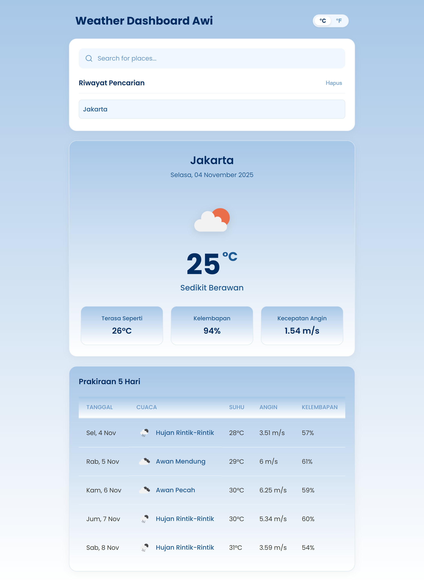

# UTS Pengembangan Aplikasi Web - Weather Dashboard Awi

Ini adalah proyek Ujian Tengah Semester untuk mata kuliah Pengembangan Aplikasi Web. Studi kasus yang dikerjakan adalah **Studi Kasus 1: Weather Dashboard**.

- **Nama:** `Awi Septian Prasetyo`
- **NIM:** `123140201`
- **Link Deployment Vercel:** `https://uts-pemweb-123140201.vercel.app/`



---

## 🚀 Deskripsi Project

Aplikasi ini adalah dashboard cuaca berbasis ReactJS (Vite) yang memungkinkan pengguna untuk mencari dan melihat informasi cuaca. Aplikasi ini dibuat dengan *layout 1 kolom* yang bersih, responsif, dan mengusung tema warna *soft blue*.

Semua fitur wajib dari ketentuan telah terpenuhi:
* **Pencarian Kota:** Form input dengan ikon *search* untuk mencari cuaca berdasarkan nama kota.
  
  
* **Autocomplete History:** *Search bar* otomatis memberikan sugesti dari riwayat pencarian sebelumnya.
  
  
* **Riwayat Pencarian:** Menampilkan daftar kota yang pernah dicari di bawah *search bar*.
  
  
* **Hapus Riwayat:** Terdapat tombol "Hapus" untuk membersihkan riwayat pencarian (`localStorage`).
  
  
* **Cuaca Saat Ini:** Menampilkan kartu detail cuaca saat ini, lengkap dengan **Icon**, **Temperature**, **Humidity**, dan **Wind Speed**.
  

* **Forecast 5 Hari:** Menampilkan **tabel prakiraan cuaca** untuk 5 hari ke depan.
  
  
* **Toggle Unit:** Dilengkapi *icon switch interface* yang modern untuk mengganti satuan suhu antara **Celsius (°C)** dan **Fahrenheit (°F)**.
  
  

## 🛠️ Tech Stack

* **Framework:** ReactJS (dibuat dengan Vite)
* **State Management:** React Hooks (`useState`, `useEffect`)
* **Styling:** CSS Murni (Flexbox, Grid, CSS-in-JSX via `<style>`)
* **HTTP Client:** Fetch API (Async/Await)
* **API:** OpenWeatherMap API
* **Deployment:** Vercel

## 📦 Cara Instalasi dan Menjalankan

Proyek ini ada di dalam folder `vite-project` sesuai dengan *screenshot* struktur file.

1.  Clone repository ini:
    ```bash
    git clone [URL-repo-anda]
    ```

2.  Masuk ke direktori proyek:
    ```bash
    cd [nama-repo-anda]/vite-project
    ```

3.  Install semua dependencies:
    ```bash
    npm install
    ```

4.  Jalankan aplikasi secara lokal:
    ```bash
    npm run dev
    ```

### Catatan API Key

Sesuai permintaan, API Key untuk OpenWeatherMap telah di-*hardcode* di dalam file `src/App.jsx` untuk kemudahan pengujian lokal.

```javascript
// di src/App.jsx
const API_KEY = 'a64d951330bf2f2d03a828782970b435';
